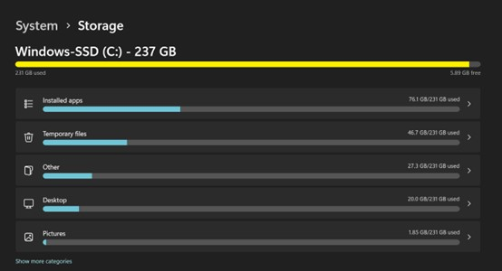
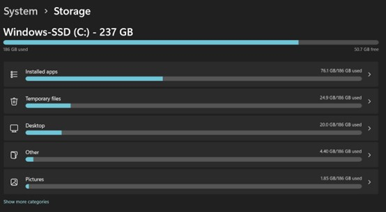

# IT Support – Slow Computer + Low Disk Space

## 🔍 Diagnosis

* Checked disk usage via Windows Storage Settings
* Identified large storage usage in Downloads (~34GB)
* Reviewed temporary files and system cache

## 📊 Task Manager check (CPU + RAM)

* CPU
 * Temporary files
  * Thumbnails
  * DirectX shader cache
 * Chrome was using a lot of CPU (around 80–90%)
 * Lots of tabs and background stuff running
* RAM (Memory)
 * Memory usage was very high (around 85–95%)
 * Too many apps open at the same time
* Disk
 * Disk usage was spiking sometimes
 * Mostly caused by background processes and cached files

## 🛠️ Actions Taken

* Cleared temporary files using Disk Cleanup
* Removed:

  * Temporary files
  * Thumbnails
  * DirectX shader cache

## ✅ Result

* Freed significant disk space
* Improved system performance

## 💡 Key Skills

* Troubleshooting disk space issues
* Safe file system management

## 🧰 Tools Used

* Windows Storage Settings
* Disk Cleanup (cleanmgr)
* File Explorer
* Command Prompt 

## 📸 Voila, Before & After

